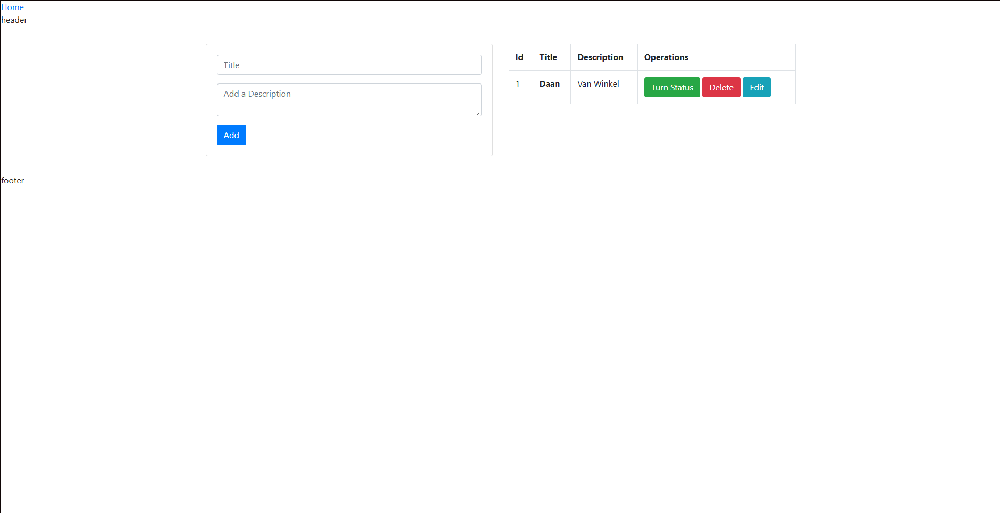

# CloudPlatforms-last: Multi-Tier Flask CRUD App on AWS

## Overview

This project demonstrates a **multi-tier cloud architecture** for a simple CRUD Flask application, deployed on AWS using Infrastructure as Code (Terraform), Docker, ECS, and RDS.



**Architecture:**
- **Frontend:** Application Load Balancer (ALB) (HTTP, port 80)
- **Middle Tier:** Flask app in Docker, running on ECS Fargate
- **Backend:** MySQL database on Amazon RDS
- **Bastion Host:** For secure access to the database from your IP


---

## Features

- Flask CRUD web app (see [`application/`](application/) folder)
- Production deployment with Gunicorn WSGI server
- Secure, private networking for app and database
- Centralized logging to CloudWatch
- Bastion host for secure DB access
- Fully automated with Terraform

---

## Prerequisites

- [Docker](https://www.docker.com/)
- [Terraform](https://www.terraform.io/downloads)
- [AWS CLI](https://aws.amazon.com/cli/) (configured with your credentials)

---

## Quick Start

### 1. Clone the Repository

```sh
git clone https://github.com/Tuadang/CloudPlatforms-Assignment-3.git
cd CloudPlatforms-Assignment-3
```

### 2. Configure SSH Key for Bastion Host

- Generate an SSH key:  
  `ssh-keygen -t rsa -b 4096 -f my-bastion-key`
- Place `my-bastion-key.pub` in your Terraform directory

### 3. Run the deployment script

```sh
./deploy.sh
```
This script will:
- Ask for a password for the database that you can later use on the bastion host to check the data
- Build your Flask app Docker image
- Push it to ECR
- Deploy all AWS infrastructure with Terraform


### 5. Access the Application

- After deployment, the script/outputs will show:
  - **Web App URL:** `http://<alb_dns_name>`
  - **Bastion Host Public IP:** for SSH access
 


### 6. SSH to Bastion Host (for DB access)

```sh
ssh -i my-bastion-key ec2-user@<bastion_public_ip>
```
From the bastion, you can connect to RDS using the credentials/output provided.

Example query: 

```sql
USE flaskdb;

SHOW TABLES;

SELECT * FROM entry;
```

---
Since this was made in the AWS Learner Lab enviroment the terraform uses a IAM role called LabRole
